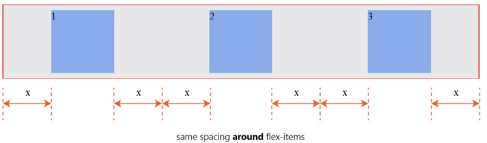
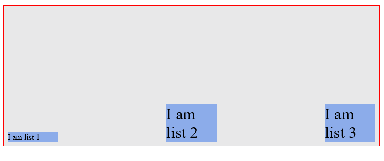
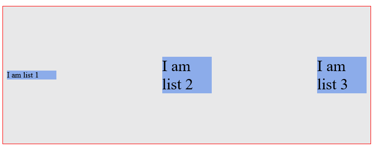
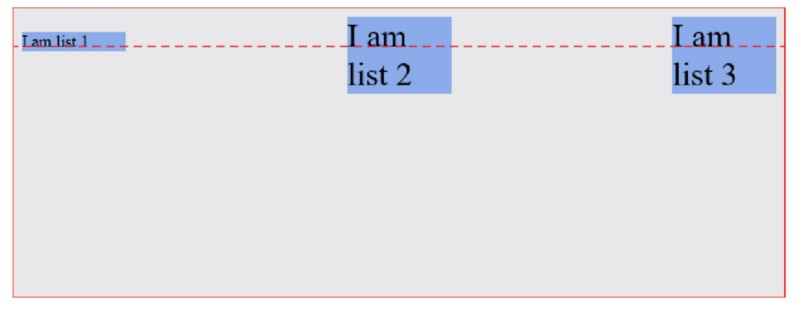

### flex
1. 使用Flex容器，首先让父元素变成一个flex容器:display:flex||display:inline-flex
2. Flex容器：父元素显式设置了display:flex
3. Flex项目：Flex容器内的子元素
4. Flex容器：
    - flex-direction:row(default)||column||row-reverse||column-reverse
    - flex-wrap:wrap||nowrap(default)||wrap-reverse 控制flex项目是否换行排列，默认不换行
    - flex-flow:flex-flow:row wrap;
    flex-direction与flex-wrap的缩写 
    - justify-content:flex-start(default 左对齐)||flex-end(右对齐)||center(居中)||space-between||space-around 
    设置flex项目在主轴上(水平方向)的对其方式
    {justify-content:space-between}
    
    {justify-content:space-around}
     
    - align-items:flex-start||flex-end||center||stretch(default)||baseline
    设置flex项目在垂直方向上的对齐方式
    {align-items:flex-start}
    
    {align-items:flex-end}
    
    {align-items:center}
    
    {align-items:stretch}
    
    {align-items:baseline}
    

    - align-content

